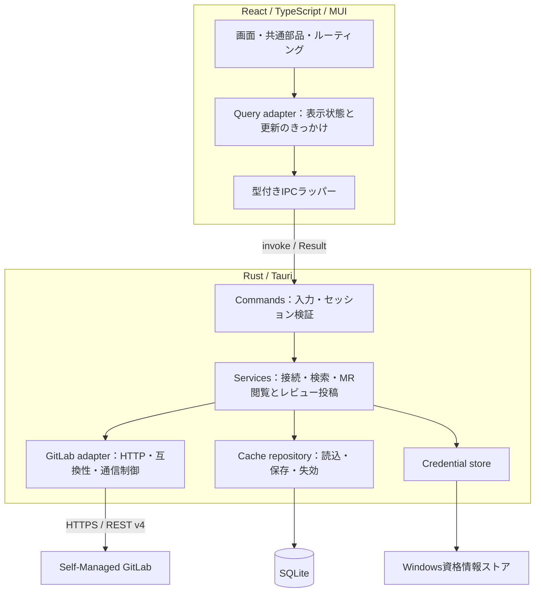

# GitLab Desktop 全体設計

設計日: 2026-09-30。2026-10-04に初期クライアントの接続・検索・キャッシュ・レビュー・配布を実装。以下は設計上の目標を含み、すべての性能目標や環境互換性を達成した記録ではありません。現在の実装範囲はREADMEと検証記録を参照してください。Self-Managed実機との互換性確認は未実施。

ユーザー要件: Self-Managed GitLabを対象に、MRの一覧・差分・レビューを使いやすくし、プロジェクトや過去MRも検索したい。Web版の待ち時間を減らし、AIによる実装を重ねてもUIを一貫させたい。

確定した条件: MR検索はタイトル・説明が対象。社内ネットワークから接続する。通常の接続・通信ではglabを使用せず、RustからGitLab APIへ直接接続する。ただしユーザーが接続画面の「glabの認証情報で接続」を明示的に選んだ場合に限り、Rustが対象URLに一致する保存済み認証を一度だけ取り込む。取得済みデータは永続キャッシュする。通常のレビュー操作までを初期完成目標に含め、MRや議論が多いときの読み込み待ち・操作のラグを優先して改善する。

起動基盤に加え、PAT接続、明示操作によるglab保存済みPAT/OAuthアクセストークンの取り込み、プロジェクト／MR検索、差分・議論取得、通常レビューAPI、Windows資格情報ストア、SQLiteキャッシュ、署名付き更新経路を実装しています。追加CA選択、アプリ自身のOAuthログイン・自動refresh、常駐同期、負荷下のp95性能検証等は後続です。GitLab.com公開APIとHTTP fixtureで検証し、認証付き実投稿や社内環境の検証結果と区別します。

## 1. 目指す体験と範囲

主動線を「プロジェクトを見つける → 現在・過去のMRを見つける → 内容・差分・議論を読む → 必要ならレビューする」に固定する。トップ画面は環境診断から「レビュー待ち・最近開いたMR・固定プロジェクト」へ置き換える。環境診断は設定画面へ移す。

最初の実用版v0.1は、プロジェクト検索、過去を含むMR検索、自分のレビュー対象、MR詳細・差分・議論の閲覧と通常のレビュー操作までを完成させる。読み取り専用版は途中の検証地点であり、完成地点ではない。検索と投稿の両方をv0.1の完了条件にする。

| 初期版に含める | 続く段階 | 当面の対象外 |
| --- | --- | --- |
| Self-Managed接続、プロジェクト検索、全状態のMR検索 | Issue、Pipeline、制限付きログ表示 | GitLab管理画面、CI設定編集、メンバー管理 |
| MR概要、差分、議論の閲覧と永続キャッシュ | マージ、コード提案の適用、Pipeline操作 | リポジトリclone/push、ブランチ操作、IDE |
| コメント、行コメント、返信、自分のコメントの編集・削除、解決/再開 | 必要と実測に応じたローカル全文検索 | GitLab全体のローカル複製、全コード索引 |
| 下書きと公開、承認/承認取消、最近開いた項目、固定、保存した検索条件 | 複数接続の同時利用 | オフラインでの書き込み自動送信 |

レビュー操作はGitLab側の権限と機能対応の範囲で提供する。組織の再認証などAPIから完結できない操作は理由を示してGitLabで開く。対応していない操作を成功扱いにしない。

初期UIは単一ウィンドウ・一つのアクティブ接続。データのキーは初めから接続先とユーザーを含める。複数接続の切替を後から追加しても、会社と自宅のデータが混ざらない構造にする。

## 2. 採用するアーキテクチャ

単一のTauriアプリの内部を機能別モジュールに分ける。別常駐サーバーやマイクロサービスは作らない。Rustは当面一つのcrateに収め、外部システムとの境界だけをテストで差し替えられるようにする。

通常の接続経路ではglabのインストール、実行、設定ファイル、認証情報に依存しない。例外として、ユーザーが「glabの認証情報で接続」を明示したときだけ、Rustが対象URLへhost-boundされた保存済み認証を読み取る。HTTP・認証・エラー処理はRustのGitLab adapterに集約し、取り込み後にglabへHTTPやrefreshを委譲しない。



| 担当 | 責務 | 持たせない責務 |
| --- | --- | --- |
| View / MUI | 表示、入力、選択、フォーカス、レイアウト | APIレスポンス解釈、SQL、認証情報管理 |
| Query adapter | 読込/再読込/失敗状態、メモリ上の表示用データ、画面滞在中の更新 | HTTPリトライ、永続キャッシュ、トークン |
| IPC Commands | 入力検証、セッション・リクエストIDの照合、DTO変換 | GitLab URLの組立て、複雑な業務ロジック |
| Application services | 検索条件の正規化、接続・閲覧・投稿の手順、キャッシュ更新 | MUI、Tauri Windowへの依存 |
| GitLab adapter | HTTP、レスポンス変換、ページング、機能差、リトライ、サイズ制限 | UI状態、DB直接操作 |
| Repositories / OS adapters | SQLite、資格情報ストア、外部ブラウザー起動 | 画面単位の条件分岐 |

APIレスポンス型、アプリ内の型、IPC型を区別する。全フィールドをコピーした巨大なGitLab型をUIへ渡さない。小さな取得処理のために多段の抽象クラスや汎用Repositoryを増やさない。

## 3. 技術選定と導入時点

| 技術 | 判断 | 理由・制約 |
| --- | --- | --- |
| Tauri 2 / Rust / React / TypeScript / MUI | 継続 | 既存基盤を使う。WebView描画は残る |
| ローカルルート | v0.1はブラウザーのhashルート | 検索条件と一覧から詳細への復帰を保持する。ルートの拡張時にRouterライブラリ導入を検討する。SSRは使わない |
| TanStack Query | v0.1で導入 | IPC呼出しをqueryFnにし、手作業の非同期状態管理を減らす |
| reqwest + Tokio | v0.1で導入 | RustにHTTPを集約。TLS/プロキシは対象環境で結合確認 |
| rusqlite + bundled SQLite | キャッシュ実装時 | 個人用のローカル保存。専用DBワーカーで同期処理を隔離する |
| Windows資格情報ストア | 認証実装時 | Rustの薄いadapter経由。keyring等のWindows対応・保守状況を実装時に確認して固定 |
| ts-rs | IPC型が増える段階 | RustのDTOからTypeScript型を生成。コマンド名とラッパーも契約テストで検査 |
| SQLite FTS5 | 後続の候補 | 日本語検索品質と保存範囲を確認してから。v0.1の検索はサーバーを利用 |
| Redux / Zustand、GraphQL、Monaco、SQLx、常駐同期 | 初期版には追加しない | 必要性が確認できていない。差分表示だけのためにIDE全体を積まない |

TanStack Queryには既定の再取得・リトライがあるため、本アプリ向けに明示設定する。[公式の既定値](https://tanstack.com/query/latest/docs/framework/react/guides/important-defaults)。型生成は[ts-rs](https://docs.rs/ts-rs/latest/ts_rs/)、DB層は[rusqlite](https://docs.rs/rusqlite/latest/rusqlite/)を基準に検討した。新しい依存は今回まだ追加していない。

## 4. 画面構成とナビゲーション

| 画面 | 主な内容 | 最優先の操作 |
| --- | --- | --- |
| 接続設定 | ベースURL、資格情報登録、接続結果、ローカル保存設定 | 接続を検証する |
| レビュー | 自分がreviewerのopen MR、作成/担当の切替、最近開いた項目 | MRを開く |
| プロジェクト | 固定・最近使ったプロジェクト、サーバー検索、namespace | プロジェクトを選ぶ |
| MR検索 | タイトル/説明、状態、作者、期間、プロジェクト/グループ | 条件を絞って開く |
| MR詳細 | 概要・変更・議論・下書き・承認状態 | 差分を確認してレビューする |
| 設定 | 接続先、資格情報更新、テーマ、キャッシュ、診断 | 設定を変更する |

固定サイドバーは「レビュー / プロジェクト / MR検索 / 設定」。上部に接続先と現在のプロジェクト、検索入口、同期状態を置く。IssueとPipelineの独立画面は後から追加する。初期版のナビゲーションに使えない機能を常設しない。

MR詳細は一覧の選択状態を保って開く。基本はファイル一覧＋差分の二領域。議論はタブまたは開閉パネルとし、常時三列にして狭くしない。960 CSS px程度ではサイドバーを折り畳み、ファイル選択をDrawerにする。広い画面だけ一覧と詳細を並べる。ウィンドウの物理サイズとCSSサイズを混同せず、Windowsの表示倍率100/125/150%で確認する。

URL例は`#/c/:connectionId/review`、`#/c/:connectionId/projects`、`#/c/:connectionId/search/mrs?...`、`#/c/:connectionId/p/:projectId/mr/:iid?tab=changes`。ユーザーIDはアクティブセッションから解決する。URLに資格情報は入れない。共有にはGitLabの元URLを使う。

検索条件・選択・ページ位置は戻る操作で復元する。フィルター変更は検索結果の先頭に戻す。入力途中の値はローカル状態、適用した条件はルート、サーバー由来の内容はQuery、テーマ等は設定に置く。

## 5. プロジェクト・過去MR検索

v0.1では、通常のProjects/Merge requests APIの検索パラメーターを使う。Self-Managedの有償機能や管理者が用意する高度な検索インデックスを前提にしない。

| 操作 | API方針 | UIで明示する範囲 |
| --- | --- | --- |
| プロジェクト検索 | `GET /projects?search=...`。参加中は`membership=true`、閲覧可能はこの制限を外す | 参加中/閲覧可能、アーカイブを含むか |
| プロジェクト内の過去MR | `GET /projects/:id/merge_requests`に検索語と状態等を付与 | 選択プロジェクト、初期状態は全状態 |
| 接続先を横断する過去MR | `GET /merge_requests?scope=all&state=all&search=...` | 現在の接続先で閲覧可能なMR |
| グループ内の検索 | 対応するグループMR一覧を利用、対応確認後に公開 | 選択グループ、子グループの扱い |
| レビュー待ち | reviewer条件＋openedを指定、サーバー対応を確認 | 自分へのレビュー依頼 |
| MRの直接指定 | 選択プロジェクトの`!123`またはGitLabのMR URLを解釈 | 接続先・プロジェクトを確定して詳細取得 |

Projectsの`membership`は参加しているプロジェクトへの制限。MR検索の通常の対象はタイトルと説明であり、コメントや差分コードの全文検索ではない。`scope`を省略して意図せず自作MRに限定しない。[Projects API](https://docs.gitlab.com/api/projects/)、[Merge requests API](https://docs.gitlab.com/api/merge_requests/)。

初期フィルターは状態・作者・更新期間・プロジェクト。レビュー担当・ラベル・ブランチは順次追加する。フィルターはチップと入力欄で表現し、初期版で独自クエリ言語は作らない。MR検索は「全状態」を既定にし、レビュー画面だけ「open」を既定にする。

Ctrl+Kは固定/最近使った項目への移動と検索画面への入口。サーバー検索はEnterで実行する。候補の自動検索を追加する場合は300ms程度のdebounceとIME変換中の抑制、古い応答の破棄を必須にする。短い日本語検索を一律に拒否しない。

1ページ30件を出発点とし、取得した次ページ情報を使用する。UIには「30件取得・続きあり」のように表示し、未取得分を含む全件数を推測しない。複数ページはIDで重複除去し、更新による順序変動は一覧を再取得して解消する。全プロジェクトを列挙して各MRを検索するN+1方式は採用しない。

過去MRはキャッシュに存在しなくてもサーバー検索で探せる。オフライン時は「保存済みの範囲」に切り替わったことを明示し、自動的にローカル結果だけを全検索の結果として見せない。v0.1では以前の検索結果や最近開いたMRの再表示までとし、任意語によるローカル全文検索は後続とする。

## 6. 読み込み・更新・キャッシュの責務

GitLabが正本、SQLiteが永続化した取得済みデータ、TanStack Queryが表示用の一時データを持つ。初期版の更新タイマーはQuery adapterだけに置く。Rustは通信の重複抑制・リトライ・保存を担当し、独立した定期ポーリングをしない。

代表フロー:

1. 画面のquery keyを確定する。接続先・ユーザー・リソース・条件・ページ・表示する版を含む。
2. 初回だけRustのCacheOnly読出しでSQLiteのスナップショットを取得する。これは通信しない。
3. Query adapterがセッション世代を確認してメモリに反映し、取得時刻を`dataUpdatedAt`相当として設定する。
4. 未取得または期限切れならNetworkOnly更新コマンドを実行する。保存済み内容があれば表示を維持し「更新中」にする。
5. Rustがセッションを検証し、GitLab取得→DTO変換→SQLite保存→結果返却を行う。
6. 有効な世代・query key・request IDの結果だけUIへ反映する。更新失敗時は古い内容と失敗理由を併記する。

キャッシュ読出し後に通信を開始する順序を共通adapterで保証する。遅れて届いたキャッシュが新しいネットワーク結果を上書きしない。Queryの`retry=false`、既定のブラウザーフォーカス再取得は無効とし、Tauriの表示/復帰通知をadapterで扱う。IPCのPromiseを捨てるだけではRustの通信をキャンセルできないため、request IDに対応するキャンセルコマンドを用意する。共有中の同一リクエストは最後の利用者が離れたときだけキャンセルする。

| データ | 鮮度の初期値（要実測） | 自動更新 |
| --- | --- | --- |
| プロジェクト一覧 | 5分 | 表示時・手動更新 |
| プロジェクト/MR検索結果 | 60秒 | 条件適用・再訪・手動更新。検索画面で連続ポーリングしない |
| open MR一覧/概要 | 30秒 | 表示中のみ60秒間隔、古ければ復帰時 |
| merged/closed MR概要 | 5分 | 表示時・手動更新。議論等は後から変わり得る |
| 議論 | 30秒 | タブ表示時・手動更新 |
| 指定commitの差分 | 版が同じなら再利用 | head変更時に別キーへ切替 |
| Pipeline（後続） | 実行中15秒を出発点 | 対象表示中のみ、終了後は抑制 |

アプリ非表示中は初期版の定期更新を停止する。復帰時に古い表示対象だけを更新し、同時に全画面を再取得しない。アプリを閉じた後の監視・通知は初期版の範囲外。将来常駐同期を導入する際は更新の担当をRustへ移し、UIタイマーを廃止する。

オフラインは読取り中心。未取得のMRや差分は開けないと表示する。書き込みのキューイングや自動再送は行わない。

## 7. IPC契約・通信制御

コマンドは`search_projects`、`search_merge_requests`、`get_merge_request`、`get_mr_diff_page`、`get_mr_discussions`のように用途単位にする。各読取コマンドはCacheOnly / NetworkOnlyを明示する。`request(url, headers)`や任意SQL実行は公開しない。

```typescript
// 契約の例。実装時にはRustから生成する。
type RequestContext = {
  sessionId: string;
  requestId: string;
};
type Snapshot<T> = {
  data: T;
  fetchedAt: string;        // UTC、サーバーで最後に確認した時刻
  source: 'cache' | 'network';
  revision: string;        // この保存結果を識別
  nextPageToken: string | null;
  completeness: 'page' | 'complete' | 'truncated';
};
type ErrorCode =
  | 'AUTH_REQUIRED' | 'FORBIDDEN' | 'NOT_FOUND' | 'RATE_LIMITED'
  | 'NETWORK' | 'TLS' | 'TIMEOUT' | 'UNSUPPORTED' | 'TOO_LARGE'
  | 'CANCELLED' | 'INVALID_INPUT' | 'STORAGE' | 'UNKNOWN_OUTCOME';
```

キャッシュ未取得はエラーと区別したmissを返す。エラーDTOにはcode、ユーザー向けmessage、retryAfterMs、サポート用request IDを持たせ、生のHTTP本文、資格情報、詳細なローカルパスは含めない。GitLab IDはRust側で整数として検証し、IPCでは十進文字列にしてJSの大整数丸めを避ける。日時はUTCで保存しUIでローカル表示する。

ページトークンは検索条件と接続セッションに結びつく不透明な値。UIが返した値を信用して任意URLへアクセスしない。GitLabのnext URLも登録済みorigin・ベースパス・APIパス内か検査する。

接続先ごとにHTTP Clientを再利用し、同時通信は4本、同一キーは1本を初期値にする。要求の待ち行列にも上限を設け、古い検索・プリフェッチから中止する。通常JSONは接続5秒/全体20秒/展開後5MiBを出発点とし、大きい応答には別の上限を与える。

GETの一時的な通信失敗・一部5xxは最大2回、jitterを含むバックオフで再試行する。429の待機期限はRustで接続先単位に共有し、UIの手動更新でも迂回しない。長いRetry-Afterはタイマーを延々と保持せず、再試行可能時刻を返す。401/403は再試行しない。非冪等な投稿は通信結果が不明でも自動再送しない。

再試行回数にはHTTPライブラリ内部の挙動も含めて検証する。Query、application、HTTP層がそれぞれ再試行して要求回数を増やさない。

## 8. Self-Managed接続と認証

接続先はoriginだけでなく、例えば`https://git.example.local/gitlab/`のベースパスも保存する。URL末尾や既定ポートを正規化し、userinfo・query・fragmentを拒否する。IPや内部ホストはSelf-Managed用途として許容するが、通信先はユーザーが登録した接続に限定する。

社内ネットワークからの直接接続を前提にする。最初はPATを候補とする。読み取り専用の検証なら従来型PATの`read_api`を使えるが、レビュー投稿まで行う従来型PATには`api`が必要。`write_repository`はAPIへの書き込み権限の代わりにならない。細粒度トークンを利用できる場合は必要操作に絞る。利用可否はサーバーバージョン・組織設定で確認し、トークン種類を固定しない。[アクセストークンのscope](https://docs.gitlab.com/security/tokens/access_token_scopes/)。

PATは専用フォームで一度受け取り、入力中のみUIメモリに存在する。IPCでRustへ渡し、接続先の本人情報を取得してユーザーIDを確定し、OS資格情報ストアへ保存する。成功/失敗時に入力値を破棄し、読出しAPIで秘密値をUIに返さない。資格情報ストアを利用できない場合に平文ファイルへ黙ってフォールバックしない。

ユーザーが「glabの認証情報で接続」を明示した場合だけ、glab保存済み認証の取り込みを許可する。Rustは接続URLから正規化したHTTPSの`authority`とサブパスを求め、`hosts[authority]`のキー、`api_host`、HTTPS、サブパスが一致する対象だけを扱う。PATとOAuthアクセストークンを対象にし、OAuthの期限はRFC3339として解釈でき、現在より未来であることを検証する。refresh tokenは取り込まず、アプリ自身のOAuthログインや自動refreshも行わない。

keyringから読む経路は、明示的に`use_keyring=true`となっている場合に限る。Rustはトークンを含まない対象hostだけの一時設定を作り、固定した`glab config get token --host`コマンドを実行する。既存のグローバル設定を書き換えず、`glab login`や`glab auth login`、`glab auth refresh`も起動しない。接続確認と`/user`確認が成功した後にだけ、取得したアクセストークンをWindows資格情報ストアへコピーし、その後のGitLab API通信はRustのHTTP adapterから直接行う。手動PAT接続はこの取り込み経路とは別に継続する。

接続フローは「URLとネットワーク設定 → TLS/HTTP接続 → 認証と本人確認 → サーバー情報/必要APIの確認 → 保存対象の表示 → 使用開始」。企業SSOのログインページが返った場合、JSONエラーやパスワード再入力に誤誘導しない。PATが禁止されている環境ではOAuth PKCEとアプリ登録を別途設計する。クライアント秘密をアプリに埋め込まない。

プロキシはOS/環境設定の利用可否を検証し、必要なら接続単位の明示設定を加える。プロキシの認証値も資格情報ストアに置く。社内CAはOS信頼ストア対応を優先し、不足時に選択した追加CAを接続単位で利用する。PAC、NTLM、mTLSは動作を仮定せず対象環境で確認する。証明書検証を無効にする回避策は採らない。[reqwestの設定API](https://docs.rs/reqwest/latest/reqwest/struct.ClientBuilder.html)。

全自動リダイレクトを避け、認証ヘッダーを別originに転送しない。本文中の外部画像や添付にもGitLabトークンを流用しない。外部URLはプロトコルを検証してOSブラウザーへ渡す。資格情報付きURLを受け付けない。

接続変更・ログアウトはセッション世代を更新し、古い要求をキャンセル、Queryを破棄、進行中のDB書込も無効化する。ログアウト後に遅れて届いた応答がキャッシュを再作成しないことを保証する。401で再認証が必要になった場合は私的データの表示を止める。403/404で権限が失われた可能性のあるリソースは、保存済みデータへ自動的に戻さない。オフライン時に現在のサーバー権限まで検証できるとは保証しない。

## 9. データ保存と互換性

ユーザープロファイル配下のアプリ用ディレクトリに保存し、Gitリポジトリ内へは置かない。

| 保存領域 | 内容 | 寿命 |
| --- | --- | --- |
| OS資格情報ストア | PAT/OAuth・プロキシの秘密値 | 明示的な更新/削除まで |
| app-state.db | 接続ID/URL、テーマ、固定したID、保存した検索条件 | ユーザー設定。キャッシュとして再作成しない |
| account別cache.db | 一覧・検索ページ・MR概要・取得済み議論と差分 | 再取得可能。容量/期限に従って削除 |
| account別drafts.db | コメント下書き、diff位置、サーバー下書きID、送信状態 | 明示破棄/公開完了まで。キャッシュ削除で失わない |
| 診断ログ | 操作種別、所要時間、件数、ステータスコード | 短期ローテーション |

キャッシュDBは接続ID＋サーバーユーザーIDごとに分ける。`resources(kind, resource_key, payload_json, fetched_at, schema_version)`と`query_pages(query_key, page_token, item_keys, next_token, fetched_at)`を基本とし、一覧中の項目と検索結果の所属関係を分ける。JSONもアプリ内で検証・縮約したDTOにする。query keyはフィルターを安定ソートした正規形から作る。

MRの識別は接続・ユーザーに加えてproject ID＋iidを使用する。表示用パスを主キーにしない。差分のキーにはdiffの版とbase/start/head SHA、ファイルパスを含める。MRの概要更新と差分の不変性を混同しない。

DB接続は専用ワーカーが所有し、待ち行列は有限にする。SQLとファイルI/OでUIやTokioの実行スレッドを塞がない。保存はトランザクションで行い、永続化に失敗しても取得済みのデータはセッション内で表示し「保存できない」状態を通知する。

初期設定: 永続キャッシュを有効にし、閲覧・検索で取得した一覧、MR概要、議論、差分本文を保存する。全インスタンスを先読みしない。永続キャッシュ全体は200MiB・最終利用30日を暫定上限とし、LRUで削除する。単一項目にもサイズ上限を設け、DB/WALを含む使用量を監視する。差分の上限超過を保存済み完全データと偽らない。CIログを追加する場合は既定でメモリのみとする。

保存を無効にする設定と、使用量・保存対象・キャッシュ削除を用意する。検索履歴は最大20件で削除可能にする。保存済み検索条件と未公開の下書きはキャッシュ容量整理で消さない。

キャッシュも会社の私的情報を含み得る。OSユーザー権限による保護はアプリ独自のDB暗号化とは異なる。保存先・対象・削除方法を設定画面で見せ、会社のローカル保存制約に合わなければ永続保存を無効にする。ログアウトは当該アカウントの秘密値とキャッシュを削除する。下書きがある段階では破棄確認を行う。DB/WAL削除は安全な媒体消去まで保証しない。

設定DBと下書きDBはスキーマ番号と移行履歴を持ち、破壊的移行前にバックアップする。移行失敗で勝手に初期化しない。再取得可能なキャッシュだけは不整合時に再作成可能とする。新しいスキーマを古いアプリで開いた場合は書き込まず、対応版での起動を案内する。

## 10. MR差分・議論・書き込み

概要と差分と議論は別リクエスト。開いていないタブをまとめて取得しない。まず概要、変更ファイルのページ、選択したファイルの描画を進める。GitLab側のAPIがページ単位の差分しか返さない場合はページを取得し、架空の「ファイルごとの軽量API」を前提にしない。

差分ビューはまずunified表示。1ファイル/ページの読み込み量に上限を設け、バイナリ、生成物、取得不可、途中省略を別状態として表示する。大きな差分は自動取得せず明示操作で続行またはWeb版へ移動する。GitLabのdiff制限や`collapsed`/`too_large`等はバージョンで異なるため、未知の項目を正常な空差分として扱わない。[MR差分API](https://docs.gitlab.com/api/merge_requests/)。

選択ファイルのみDOMへ描画し、巨大ファイルには上限を設ける。大量の行・スレッドは可視範囲と前後だけを描画する仮想化を採用し、件数と実測で適用を切り替える。議論は解決済みを折り畳み、長い本文や返信を必要時に展開する。Markdown/ハイライトの結果は内容・言語・テーマをキーに再利用し、重い解析はWorkerかRustの専用処理へ分離する。日本語・タブ・改行コード・rename・削除行・長い一行をテストする。

ページングはGitLabから取得する量、仮想化はDOMへ描画する量を制限する。両方が必要である。議論APIのページ数を小さくしても、一つの議論に多数のnoteが含まれる場合がある。応答サイズ上限に達したら「取得制限」と表示し、架空の返信単位ページングを想定しない。

Markdownはraw HTMLを無効にしてレンダリングし、リンクのschemeを検証する。GitLab特有の記法を再現できない場合は元ページを開けるようにする。SVGやリモートHTMLをWebViewの特権コンテキストで実行しない。

レビュー操作は次の単位で実装する。

| 操作 | 契約 |
| --- | --- |
| 全体コメント・行コメント・返信 | 本文、対象MR/議論、必要な差分位置を明示して送信 |
| 自分のコメント編集・削除 | 対象IDと取得時の内容を確認。更新競合時は再確認し、他の更新を黙って上書きしない |
| スレッド解決・再開 | 解決可能な議論だけに提供。サーバーの権限判定に従う |
| 下書き・レビュー公開 | ローカル保存→対応APIがあればサーバー下書きへ保存→公開対象を確認→公開 |
| 承認・承認取消 | 現在のユーザーの承認だけを操作。承認時は確認したhead SHAを送信 |
| ファイル確認済み | ローカルの進捗として差分版と結びつける。GitLabの承認状態とは区別 |

投稿は下書き→送信中→成功/失敗/結果不明を区別する。差分コメントにはbase/start/head SHAとold/new位置を保存し、headが変わったら古い位置に黙って投稿しない。[Discussions API](https://docs.gitlab.com/api/discussions/)。投稿タイムアウトでは「未投稿」と断定せず、サーバー側の結果を確認してから再送を選ぶ。ローカル操作IDや二重クリック防止だけでサーバーの冪等性を保証できるとは考えない。

サーバー下書きIDとローカル下書きIDを対応させる。GitLabの`bulk_publish`はそのユーザーのMR内の全下書きを公開するため、Web側で作った下書きも対象になり得る。アプリで選んだ下書きだけを公開する場合は各IDのpublishを使い、逐次実行して個別の結果を記録する。一部だけ成功しても全件再送しない。下書きAPI非対応時はローカル下書きから個別投稿し、非公開の共同レビュー機能があるようには見せない。[Draft Notes API](https://docs.gitlab.com/api/draft_notes/)。

コメント公開と承認は独立したAPI操作であり、一括トランザクションではない。結果も分けて表示する。新しいAPIの`reviewed`/`requested_changes`等は機能確認後に公開し、正式な承認と混同しない。

コメント編集前の再取得で既知の変更を検出するが、対象APIに条件付き更新がない場合、確認直後の同時編集まで原子的に防げるとは保証しない。サーバーの返却内容を反映し、下書きを残して復旧できるようにする。

投稿成功時は対象note/議論/承認状態のキャッシュを更新し、関連する概要だけを失効させる。MRの全差分や全検索を再取得しない。書き込み開始前の読み取り結果が成功後の状態を上書きしないよう、リソースごとの世代とキャンセル・再取得を共通adapterで管理する。入力中の本文を定期更新で置き換えない。

承認は初期完成範囲に含め、権限・サーバー対応と対象SHAを確認する。組織の再認証要件でAPI承認が成立しない場合はGitLabで開く。マージ、Pipelineの再実行/取消は後続の独立した操作設計にする。表示中の古い状態だけで実行を許可しない。サーバーが正式な権限制御を行い、ローカルのボタン表示はその代わりにならない。[承認API](https://docs.gitlab.com/api/merge_request_approvals/)。

Pipelineログを追加する場合は、上限付きの一時データとして扱う。Jobs trace APIに汎用的な差分ストリーミングがあると仮定せず、対象サーバーでRange等の対応を検証する。非対応なら低頻度・上限付き取得かWebへの移動を選ぶ。[Jobs API](https://docs.gitlab.com/api/jobs/)。

## 11. バージョン差とエラーの扱い

接続時にmetadata/versionを可能な範囲で取得するが、その取得失敗だけで全機能を拒否しない。バージョン情報と実際の必要APIの応答から`CapabilitySet`を作り、各機能をsupported / unsupported / unknownで管理する。HTTP 403を「機能非対応」と一括解釈しない。[Metadata API](https://docs.gitlab.com/api/metadata/)。

最小対応GitLabバージョンは対象サーバーの確認後に決める。optionalフィールド、null、未知のenum値を受け入れ、不明な状態は「不明」と表示する。高度な検索が使えなくてもProjects/MR検索が成立することを優先する。RESTを基本とし、GraphQLは計測上のN+1等を解消する理由がある場合にadapter内部へ限定して追加する。

| 状態 | 表示と復旧 |
| --- | --- |
| 初回読込・保存済みなし | 骨組み表示。空一覧とは区別 |
| 保存済みを再確認中 | 内容を維持し、更新中と時刻を表示 |
| オフライン/一時障害 | 保存済みなら時刻付きで表示。未取得なら再試行案内 |
| 401 | 再認証を案内し、私的データの通常表示を停止 |
| 403/404 | 権限不足/不存在の可能性を説明。キャッシュで迂回しない |
| 429 | 再試行可能時刻を表示 |
| 取得上限・一部取得 | 「省略あり」「続きあり」を明示 |
| 書き込み結果不明 | 自動再送せず、結果確認へ誘導 |

## 12. UIを一貫させる設計

テーマだけでなく、部品と画面の構造も固定する。具体的な規則は[UI設計](ui-design.md)にまとめる。

デザイントークン → MUI既定値 → アプリ共通部品 → 機能画面という順序で構築する。新しい画面は既存の一覧・詳細・設定パターンへ当てはめる。feature側で別の色・行高・空状態を発明しない。共通パターン変更はUIカタログと代表スクリーンショットを一緒に更新する。

現在のテーマは初期サンプルであり、現在のピンク色やカードの配置を製品デザインとして確定したわけではない。最初のプロジェクト/MR一覧を使って情報密度と操作感を決め、その時点の基準を固定する。

## 13. 想定ディレクトリ

以下は移行先の設計。今回フォルダーの移動や機能の実装は行わない。

```text
src/
  app/                 # Router、Provider、session、起動・終了
  features/
    connections/       # 接続設定
    projects/          # プロジェクト検索・固定
    merge-requests/    # レビュー一覧・詳細・差分・議論
    search/            # MR横断検索・保存条件
    settings/
  shared/
    ui/                # AppShell、PageHeader、DataList、AsyncState等
    theme/             # tokens、MUI defaults、typography
    ipc/               # 唯一のinvoke入口、コマンドラッパー
    query/             # キャッシュhydrate、キー、更新方針
    contracts/         # Rustからの生成型
  catalog/             # 状態別に表示できるUIカタログ
src-tauri/src/
  commands/            # Tauri境界
  application/         # 接続・検索・MR等のユースケース
  domain/              # ID、検索条件、MR、capability、error
  adapters/gitlab/     # HTTP DTO、API、互換性
  adapters/storage/    # SQLite、migration、cache
  adapters/credentials/
  runtime/             # session、cancel、limit、診断
```

現行の`src/theme.ts`や`src/components`は、利用先が増える段階で小さく移す。移行時にAGENTS.mdとdesign guardの許可パスも更新する。未実装機能のための空ディレクトリや空traitは先に大量生成しない。

## 14. 性能目標と検証

以下は合否を議論するための初期目標で、実測結果ではない。

| 対象 | 目標案 | 計測条件 |
| --- | --- | --- |
| 起動から操作可能 | p95 2秒以内 | release、同じPC、ネットワーク待ちを起動の前提にしない |
| 保存済み一覧・検索への復帰 | p95 100ms以内 | 一覧30件、ウォームキャッシュ |
| DBからの初回キャッシュ表示 | p95 200ms以内 | 同じDB容量、ディスク条件を記録 |
| API応答後の一覧反映 | p95 100ms以内 | 通信時間と分離 |
| レビュー本文入力・ファイル切替の反応 | p95 150ms以内 | 保存済みデータ、下記の大量fixtureで計測 |
| 検索応答の順序 | 古い条件の結果を一度も表示しない | 遅延・逆順応答を注入 |
| MR差分操作 | 長い主スレッド停止を避ける | 小/大/長行/大量ファイルを別計測 |

初期30件の一覧で行ごとの詳細APIを発行しない。未表示タブのリクエストは0件とする。フロントエンドの起動JS、取得件数、IPC payload、ネットワーク時間、DB時間、描画時間を別々に記録する。メモリはWebView2子プロセスを含め、キャッシュ温存後の往復操作で単調増加しないか確認する。具体的なメモリ上限は初回実測後に決める。

「レビューが多い」は、一覧のMR件数、差分量、議論/コメント数に分けて検証する。以下は利用実績ではなく、初期の負荷検証用データ規模である。

| 負荷 | fixtureと確認内容 |
| --- | --- |
| 多数のMR | 初回30件、追加ページで累積1,000件。DOM量を可視行付近に制限し、戻る位置と選択を保持 |
| 大きい差分 | 100ファイル・合計10,000行、および単一巨大ファイル/長行。選択ファイル以外の本文を描画しない |
| 多数の議論 | 500スレッド・合計2,000コメント。スクロールと本文入力、返信公開、解決で全件を再描画しない |
| 頻繁な移動 | 複数MRを往復、タブ切替、バックグラウンド更新。未使用メモリと解析結果の保持にも容量上限を設ける |

一覧/差分の仮想化は200行程度を初期の切替候補にし、可変高の議論は高さ計測とスクロール位置保持を検証する。フォーカス中・編集中の要素を不意にアンマウントしない。下書き状態は仮想化される行の外で保持する。各キー入力でMR全体のJSONを複製・保存せず、下書き単位で更新し、保存はdebounceと画面離脱時のflushを組み合わせる。最終編集の保存前に閉じる場合は未保存状態を扱う。

同じreleaseビルド・PCでコールド/ウォームを分け、複数回の測定からp95を求める。キャッシュ表示、更新後の表示、入力応答を別々に評価する。GitLab側のAPI遅延はRust化だけでは消えない。キャッシュ済み表示を先に出し、更新中も操作を止めないことで待ち時間を減らす。Web版との比較は同じMR・同じネットワーク条件で行う。

テストは、URL/パス正規化、検索条件、DTO変換、ページング、401/403/429、通信キャンセル、ログアウト中の遅延応答、DB移行、キャッシュ容量上限を重点にする。実トークンなしのHTTP fixtureと隔離DBを使用する。UIは読み込み・空・失敗・古いデータ・部分取得と、明暗/狭幅/キーボードの代表ケースを確認する。

レビューの検証には、投稿成功後の古いGET応答、タイムアウト後の結果照合、下書き公開の部分成功、Web側下書きの混在、head変更、権限喪失、承認だけ失敗するケースを含める。

ログは構造化し、秘密値、検索本文、MR本文、コードを既定では記録しない。テレメトリーの外部送信は入れない。診断エクスポートは内容を確認できる形でユーザー操作から行う。

## 15. 開発順序と完了条件

| 段階 | 実装する一続きの体験 | 完了条件 |
| --- | --- | --- |
| A: 接続とプロジェクト | 接続設定→本人確認→プロジェクト検索→固定 | 対象Self-Managedで動作。サブパス/CA/認証失敗を説明でき、秘密値を保存・削除できる |
| B: 現在・過去のMR | レビュー待ち→MR検索→概要→戻る | merged/closedが検索できる。タイトル/説明と対象範囲を明示。条件と位置を復元できる |
| C: 再訪の高速化 | 取得済みデータ保存→即時表示→再取得 | 二重取得、逆順応答、アカウント混在なし。容量制御と削除が動く |
| D: 読むレビュー | 差分と議論→版の切替→Webで開く | 差分/議論も永続保存。取得制限と部分表示を区別。大量データで計測する中間地点 |
| E: 投稿するレビュー | 下書き→コメント/行コメント/返信→編集/削除→解決/再開 | 版変更・重複防止・結果不明・部分成功・下書き復元を扱う |
| F: レビューの完成 | 承認/承認取消→連続したMRレビュー | 対象サーバーの機能/権限を確認。検索・投稿・大量データ性能を通して**A〜Fでv0.1完成** |
| G: 必要な拡張 | マージ、Issue、Pipeline、コード提案適用等 | 実際の使用頻度と計測に基づいて一つずつ追加 |

各段階で画面、Rustコマンド、エラー、検証を一緒に仕上げる。先に全バックエンドを作り切ってからUIを載せる順序にはしない。署名・インストーラー・自動更新は日常利用の配布形態が決まってから追加する。アプリ終了は初期版では終了とし、トレイに残る動作を暗黙に入れない。

## 16. 実装前に残る確認事項

- GitLabバージョンとPATの発行・利用可否。これで認証方式と対応機能の下限を確定する。秘密値はチャットでは受け取らない。
- 実接続の段階で接続先URLをアプリに登録し、TLS/認証/必要APIを確認する。社内ネットワークに接続できることは確認済み。CAやプロキシの追加設定は実際に必要な場合に調べる。
- 実データの規模と待ち時間は接続後に測る。それまでは第14節の負荷fixtureを使うため、件数の回答を設計の前提条件にしない。

タイトル/説明検索、レビュー操作、直接API接続、永続キャッシュ、性能改善という機能範囲は確定した。残るのは接続環境との互換性確認であり、全体設計はこの条件で進める。実サーバーで確認できていない機能を利用可能と断定しない。
